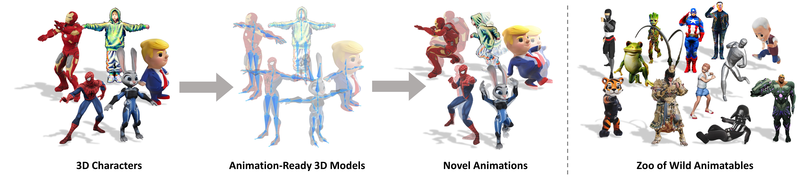

<div align="center">

# Make-It-Animatable: An Efficient Framework for Authoring Animation-Ready 3D Characters

_**Zhiyang Guo,
Jinxu Xiang,
Kai Ma,
Wengang Zhou,
Houqiang Li,
Ran Zhang**_

<a href='https://arxiv.org/abs/2411.18197'></a>
<a href='https://jasongzy.github.io/Make-It-Animatable/'></a>
<a href='https://make-it-animatable.jasongzy.com'></a>
<a href='https://huggingface.co/spaces/jasongzy/Make-It-Animatable'></a>



</div>

## Coming Soon...


## Citation

```bibtex
@article{guo2024make,
  author={Guo, Zhiyang and Xiang, Jinxu and Ma, Kai and Zhou, Wengang and Li, Houqiang and Zhang Ran},
  title={Make-It-Animatable: An Efficient Framework for Authoring Animation-Ready 3D Characters},
  journal={arXiv preprint arXiv:2411.18197},
  year={2024},
}
```
